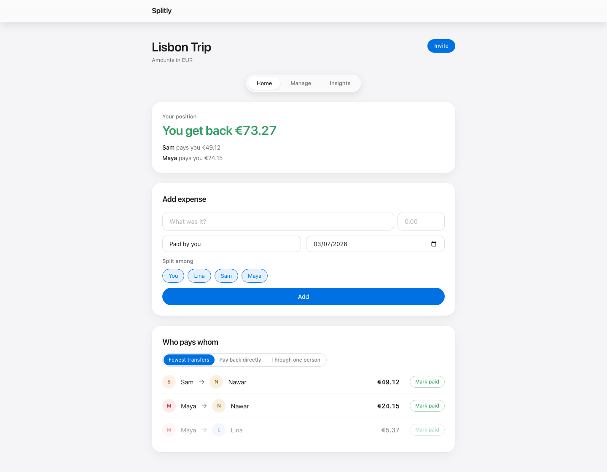

# Splitly

[](https://github.com/NawarAli1912/splitly/actions/workflows/ci.yml)

Split group expenses and settle up with the minimum number of payments.

Add expenses for a trip or a shared flat, and Splitly tells you exactly who pays whom — not 40 back-and-forth transfers, but the minimal set (at most n−1 for n people). Prefer paying back each person directly, or routing everything through one friend? Settlement strategies are pluggable.



## What this demonstrates

- **Graph algorithms** — settlement is a min cash flow problem: net balances (paid − consumed), then greedy matching over two max-heaps, O(n log n); alternative strategies (direct payback, via a banker) plug into the same `ISettlementStrategy` seam
- **Correct money handling** — a `Money` type over integer cents; division distributes remainder cents deterministically, no cent is ever lost
- **Rich domain model** — every invariant lives inside the `ExpenseGroup` aggregate; invalid state is unrepresentable from outside
- **REST API discipline** — request/response contracts, thin controllers, one handler per use case, every error an RFC 7807 `problem+json` body
- **Full-stack integration tests** — Testcontainers Postgres + `WebApplicationFactory`, the whole journey through real HTTP
- **Capacity thinking** — [SYSTEM_DESIGN.md](SYSTEM_DESIGN.md): an explicit load model for 1M users / 500 rps peak, the bottlenecks in the order they'll appear, and a staged scaling plan

## API

```
POST   /groups
GET    /groups/{id}
DELETE /groups/{id}
POST   /groups/{id}/participants
DELETE /groups/{id}/participants/{participantId}
POST   /groups/{id}/expenses
GET    /groups/{id}/expenses?page=1&pageSize=20
DELETE /groups/{id}/expenses/{expenseId}
POST   /groups/{id}/payments
GET    /groups/{id}/payments?page=1&pageSize=20
DELETE /groups/{id}/payments/{paymentId}
GET    /groups/{id}/settlement?strategy=minimum-transfers|direct-payback|via-banker&hub={participantId}
```

Errors follow one contract: `400` validation (field-level details), `404` not found, `409` conflict — always `application/problem+json`.

## Run

The whole product — UI, API, Postgres — with one command:

```bash
docker compose up -d --build
```

Then open http://localhost:3000.

For development (hot reload):

```bash
docker compose up -d postgres
dotnet run --project src/Splitly.Api
npm run dev --prefix ui       # http://localhost:5173, proxies /api to the API
```

## Test

```bash
dotnet test               # unit + integration (integration tests start their own Postgres via Testcontainers)
```

## Stack

ASP.NET Core (.NET 10) · EF Core + PostgreSQL · ErrorOr · xUnit + Testcontainers
